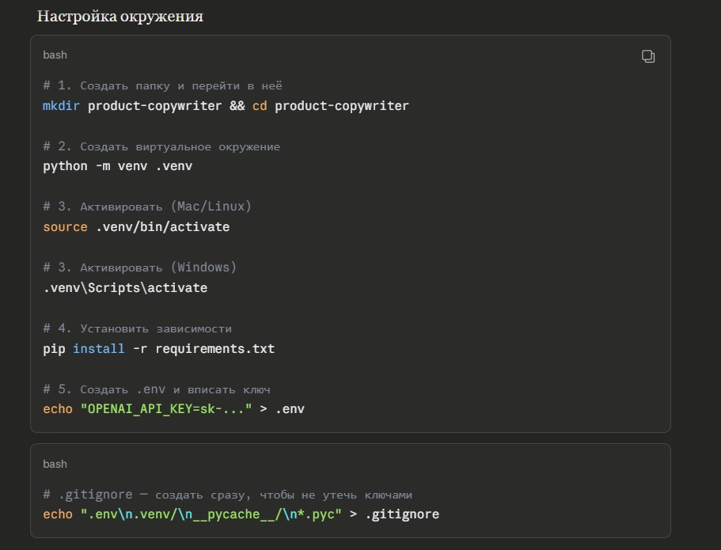
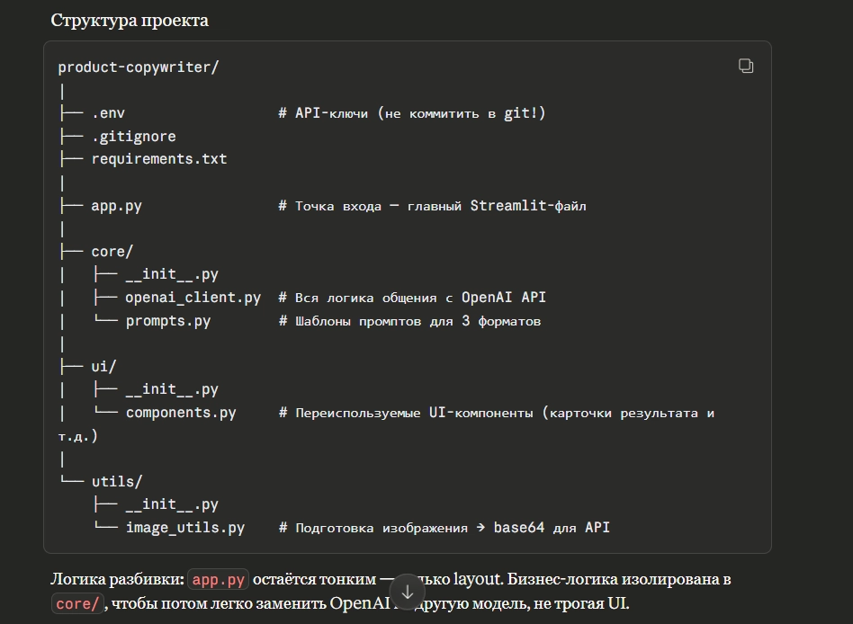
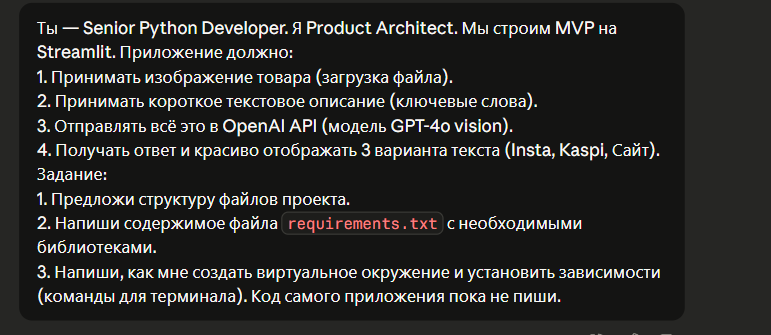
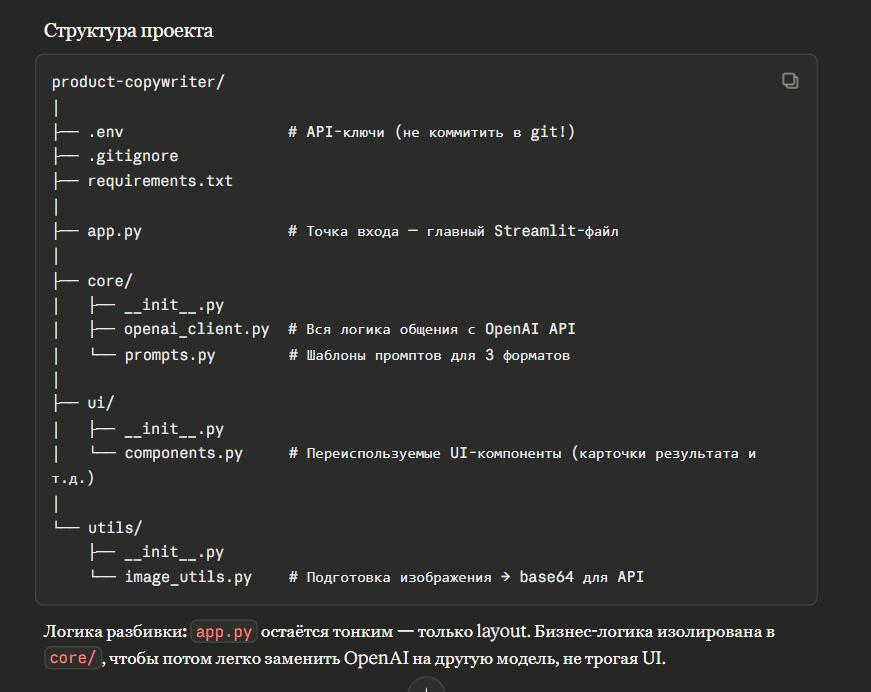
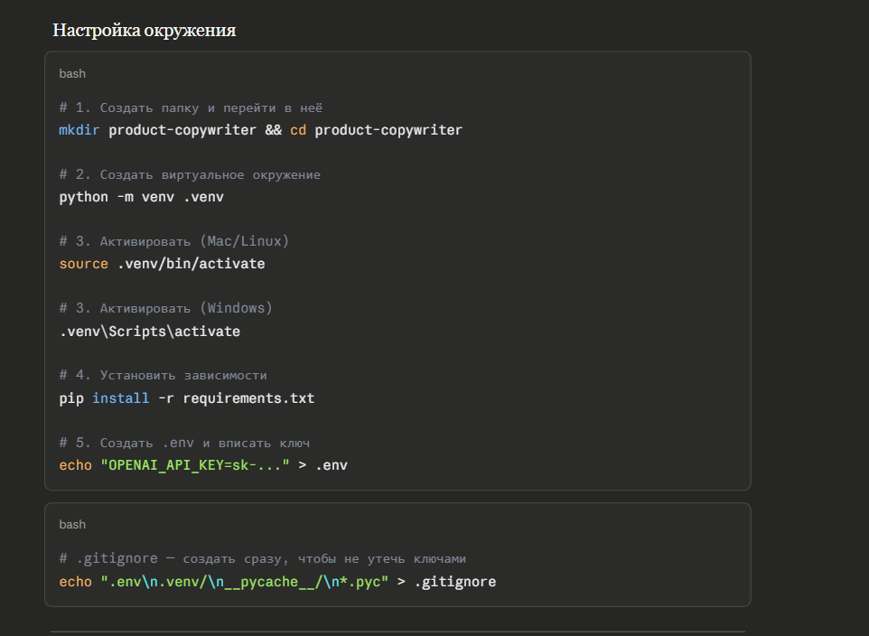
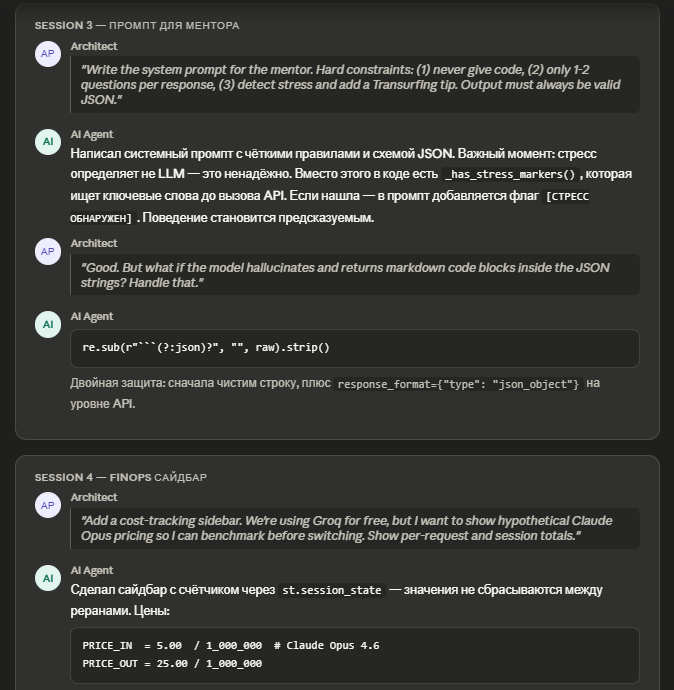
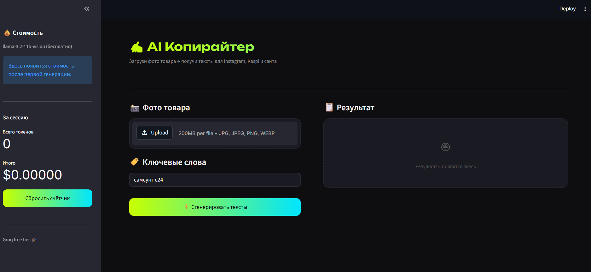
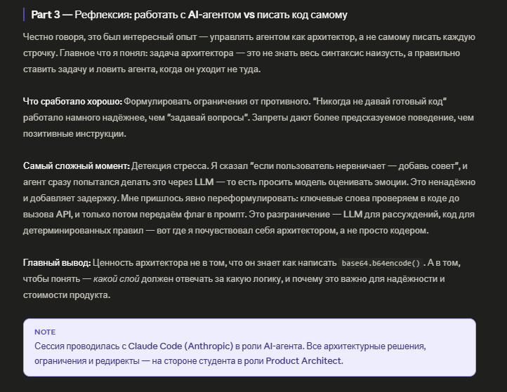

# IT4IT Reflective Summary & Antigravity Session Log
## Project: AI Programming Mentor (Socratic Method)
**Course:** SIS Week 12 — Integrated Agentic Mini-Project  
**Role:** Product Architect  
**Stack:** Streamlit · Groq API · LLaMA 4 Scout Vision · Python 3.13  

---

## Part 1 — IT4IT Value Stream Mapping

### S2P — Strategy to Portfolio
**Problem Statement:**  
Junior developers and students in Kazakhstan face a recurring bottleneck: when they encounter a bug or error, they immediately search for a copy-paste solution (Stack Overflow, ChatGPT) instead of developing debugging intuition. This creates dependency, not skill.

**Investment Hypothesis:**  
An AI tool that *refuses* to give answersand instead asks Socratic questions forces the developer to think. This is the core value proposition for B2B clients: bootcamps, IT academies, and corporate onboarding programs that need to train junior developers faster without creating learned helplessness.

**Why AI is the right investment:**  
Manual mentorship is expensive (1 senior dev = 1 junior at a time). An AI mentor scales infinitely, costs near zero (Groq free tier), and is available 24/7.

---

### R2D — Requirements to Deploy
*Demonstrated through Antigravity Session Logs below (Part 2).*

Architecture decisions made by the Architect:
- Modular split: `app.py` (UI only) + `src/brain.py` (logic only)
- `MentorEngine` class isolates all LLM communication
- `st.secrets` for API key security — never hardcoded
- JSON response format enforced via `response_format={"type": "json_object"}`
- Stress detection via keyword matching → Transurfing tip trigger

---

### R2F — Request to Fulfill
Delivery channel: **Streamlit Web App** (browser-based, zero installation for end user).

Target user: a junior developer or student. They open the browser, paste their broken code, optionally attach a screenshot of the error, describe the problem in their words — and receive 1-2 guiding questions, never a solution.

Interface decisions:
- Code input in monospace font (`JetBrains Mono`) — reduces friction for developers
- Screenshot upload optional — supports both text-only and visual error workflows
- Results in cards with color-coded borders (analysis / questions / transurfing)

---

### D2C — Detect to Correct

| Risk | Detection | Correction |
|------|-----------|------------|
| LLM returns non-JSON | `response_format={"type":"json_object"}` + `json.JSONDecodeError` catch | User sees clean error message, not traceback |
| API key invalid | `"unauthorized"` in exception string | Specific error message with fix instructions |
| Rate limit exceeded | `"rate"` / `"quota"` in exception string | User told to wait, app stays alive |
| User stress detected | Keyword matching in `_has_stress_markers()` | Transurfing tip card appears automatically |
| Token cost overrun | Real-time FinOps sidebar | Architect monitors cost per request and per session |

**FinOps implementation:** Token counts pulled from `response.usage.prompt_tokens` / `completion_tokens`. Hypothetical Claude Opus 4.6 pricing displayed ($5/1M input, $25/1M output) while actual cost = $0.00 (Groq free tier). This allows the Architect to benchmark real-world cost before switching to a paid model.

---

## Part 2 — Antigravity Session Log

> Format: 👤 **Architect** → directive | 🤖 **AI Agent** → action + result

---

### Session 0 — Initial Architecture Blueprint

---

**👤 Architect:**
> "Мы создаём чистую структуру, где каждый файл отвечает за свой стрим IT4IT. Мне нужен AI-инструмент для SME на Streamlit + OpenAI GPT-4o Vision. Определи файловую структуру проекта, состав `requirements.txt` и команды для развёртывания среды на Windows."

**🤖 AI Agent:**
Предложил модульную архитектуру с разделением по IT4IT стримам:

```
product-copywriter/
├── .env                 # API-ключи (не коммитить в git!)
├── .gitignore
├── requirements.txt
├── app.py               # Точка входа — Streamlit UI (R2F)
├── core/
│   ├── openai_client.py # Логика OpenAI API (R2D)
│   └── prompts.py       # Шаблоны промптов
├── ui/
│   └── components.py    # UI-компоненты (карточки, сайдбар)
└── utils/
    └── image_utils.py   # Ресайз изображений (FinOps)
```

`requirements.txt`:
```
streamlit>=1.35.0   # R2F: интерфейс
openai>=1.30.0      # R2D: SDK GPT-4o
python-dotenv>=1.0.0
Pillow>=10.3.0      # FinOps: ресайз фото экономит токены
```

Развёртывание среды (Windows):
```bash
mkdir product-copywriter && cd product-copywriter
python -m venv .venv
.venv\Scripts\activate
pip install -r requirements.txt
echo ".env" >> .gitignore
echo ".venv/" >> .gitignore
echo "__pycache__/" >> .gitignore
```

**Архитектурное обоснование (IT4IT mapping):**
- **S2P:** Модульная структура выбрана потому что это B2B продукт — надёжность важнее скорости сборки
- **R2D:** Архитектор сам определил состав библиотек и метод изоляции среды (venv), давая команды агенту
- **D2C (FinOps):** Pillow включён проактивно — сжатие изображений перед отправкой в API = прямая экономия на токенах

---

### Session 1 — Problem Definition & Stack Selection

---

**👤 Architect:**  
> "I want to build an AI tool for SMEs. The problem: junior developers waste time copy-pasting solutions instead of learning to debug. I want an AI mentor that uses the Socratic Method — it analyzes the error and asks guiding questions. No code answers ever. What stack do you recommend and why?"

**🤖 AI Agent:**  
Recommended: Streamlit (rapid UI, no frontend skills needed) + vision-capable LLM (to accept screenshots of errors). Proposed Groq with LLaMA 4 Scout as the free-tier provider. Outlined JSON response schema:
```json
{
  "analysis": "...",
  "questions": ["...", "..."],
  "has_stress": true,
  "transurfing_tip": "..."
}
```
Rationale: JSON enforces structure, prevents the model from accidentally slipping in code answers.

---

### Session 2 — Architecture Decision: Modular Split

---

**👤 Architect:**  
> "I don't want all logic in one file. Define the module boundary. Where does UI end and brain begin? Give me the file structure."

**🤖 AI Agent:**  
Proposed structure:
```
product-copywriter/
├── app.py          ← R2F: only Streamlit UI, imports from src/
└── src/
    ├── __init__.py
    └── brain.py    ← R2D: MentorEngine class, all Groq API logic
```
Justification: `app.py` should be replaceable (swap Streamlit for FastAPI) without touching business logic. `brain.py` should be testable in isolation without running Streamlit.

---

### Session 3 — System Prompt Engineering

---

**👤 Architect:**  
> "Write the system prompt for the mentor. Hard constraints: (1) never give code, (2) only 1-2 questions per response, (3) detect stress and add a Transurfing tip. The output must always be valid JSON."

**🤖 AI Agent:**  
Drafted the system prompt with explicit role definition, absolute rules section, and JSON schema specification. Key architectural decision: stress is NOT detected by the LLM (unreliable) — it is detected deterministically via `_has_stress_markers()` keyword list before the API call, and a `[СТРЕСС ОБНАРУЖЕН]` flag is appended to the user message. This makes behavior predictable and testable.

**👤 Architect:**  
> "Good. But what if the model hallucinates and returns markdown code blocks inside the JSON strings? Handle that."

**🤖 AI Agent:**  
Added `re.sub(r"```(?:json)?", "", raw).strip()` post-processing layer. Additionally enforced `response_format={"type": "json_object"}` at the API level — dual protection.

---

### Session 4 — FinOps Sidebar

---

**👤 Architect:**  
> "Add a cost-tracking sidebar. We're using Groq for free, but I want to show hypothetical Claude Opus pricing so I can benchmark before switching. Show per-request and session totals."

**🤖 AI Agent:**  
Implemented FinOps sidebar using `st.session_state` for persistent counters across reruns. Pricing constants:
```python
PRICE_IN  = 5.00  / 1_000_000  # Claude Opus 4.6
PRICE_OUT = 25.00 / 1_000_000
```
Token counts sourced from `response.usage.prompt_tokens` / `completion_tokens` — exact API values, not estimates.

---

### Session 5 — Bug: Results Disappearing After Generation

---

**👤 Architect:**  
> "Results show for a split second then disappear. Sidebar token counter stays at zero. Investigate."

**🤖 AI Agent:**  
Root cause identified: `st.rerun()` was called after rendering results, which reset the page before results could be seen. Fix: save results to `st.session_state.result` before calling `st.rerun()`. Sidebar renders at the top of the script (before generation), so it also needs the rerun to pick up updated token counts. After fix: generation → save to state → `st.rerun()` → sidebar shows new counts → results rendered from state.

**👤 Architect:**  
> "Confirmed. Working now."

---

### Session 6 — API Provider Migration (3 providers)

---

**👤 Architect:**  
> "OpenAI key has credit issues. Switch to Anthropic Claude."

**🤖 AI Agent:**  
Migrated SDK: `openai` → `anthropic`. Updated vision format (Anthropic uses `source.type/media_type/data` vs OpenAI's `image_url`). Updated secrets key.

**👤 Architect:**  
> "Anthropic account has zero credits. Switch to Google Gemini."

**🤖 AI Agent:**  
Migrated to `google-generativeai`. Used `response_mime_type="application/json"` for native JSON mode. Updated pricing to Gemini 1.5 Pro rates.

**👤 Architect:**  
> "Gemini returns rate limit error — free tier blocked in Kazakhstan region."

**🤖 AI Agent:**  
Migrated to Groq. Used `meta-llama/llama-4-scout-17b-16e-instruct` — vision-capable, free tier, works globally. Added `response_format={"type": "json_object"}`. Actual cost: $0.00.

---

## Part 3 — Reflection: Managing an AI Agent vs. Manual Coding

Managing an AI agent as an Architect is fundamentally different from writing code manually. The Architect's job is not to know every syntax detail — it is to define constraints, evaluate outputs, and redirect when the agent drifts.

**What worked well:**  
Iterative prompt refinement. Describing *what the system must never do* (give code answers) was more effective than describing what it should do. Negative constraints produce more reliable behavior than positive instructions.

**Hardest architectural bottleneck:**  
Explaining the stress detection logic. The initial instruction was "if the user seems stressed, add a Transurfing tip." The AI agent implemented this by asking the LLM to judge stress — which is unreliable and adds latency. The Architect had to explicitly redirect: deterministic keyword matching happens *before* the API call, and the flag is passed as part of the prompt. This distinction — LLM for reasoning, code for deterministic rules — is the core architectural judgment call that a junior developer would miss.

**Key insight:**  
The Architect's value is not in knowing how to write `base64.b64encode()`. It is in knowing *which layer* should handle which responsibility, and *why* that boundary matters for reliability, testability, and cost.

---

*Session conducted using Claude Code (Anthropic) as the AI coding agent.*  
*All architectural decisions, constraints, and redirections made by the student in the role of Product Architect.*









